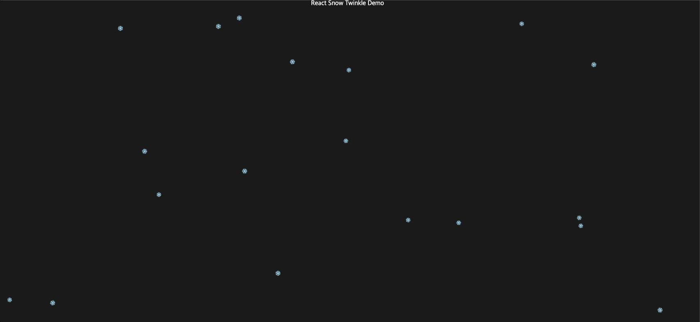

# React Snow Twinkle

눈이 내리는 효과를 쉽게 구현할 수 있는 React 컴포넌트입니다.



## 프로젝트 개요

React Snow Twinkle은 웹사이트나 웹 애플리케이션에 아름다운 눈 내리는 효과를 추가할 수 있는 React 컴포넌트 라이브러리입니다. TypeScript로 작성되어 타입 안정성을 보장하며, 가볍고 사용하기 쉽습니다.

### 주요 기능
- 커스터마이징 가능한 눈송이 디자인
- 성능 최적화된 애니메이션
- TypeScript 지원
- 다양한 설정 옵션 제공
- 브라우저 호환성 보장


## 사용 방법

### 기본 사용법

가장 기본적인 사용 예시:

```tsx
import { SnowTwinkle } from 'react-snow-twinkle';

function App() {
  return (
    <div>
      <SnowTwinkle />
      <h1>My Winter Wonderland</h1>
    </div>
  );
}
```

### 커스텀 설정

다양한 옵션을 사용하여 눈 효과를 커스터마이징할 수 있습니다:

```tsx
import { SnowTwinkle } from 'react-snow-twinkle';

function App() {
  return (
    <div>
      <SnowTwinkle 
        snowflakeCount={100}
        speed={1.5}
        wind={2}
        color="#ffffff"
        size={4}
        opacity={0.8}
        blur={2}
      />
      <h1>Customized Snow Effect</h1>
    </div>
  );
}
```

### 설정 옵션

| 옵션 | 기본값 | 최대값 | 설명 |
|------|--------|--------|------|
| snowflakeCount | 50 | 500 | 화면에 표시될 눈송이의 수 |
| fallSpeed | 5 | 20 | 눈이 떨어지는 속도 |
| flakeSize | 10 | 100 | 눈송이의 크기 |
| opacity | 1 | - | 눈송이의 투명도 |
| flakeShape | "❄️" | - | 눈송이의 모양 |

### 개발 환경 설정

로컬에서 개발하려면:

1. 저장소를 클론합니다:
```bash
git clone https://github.com/yourusername/react-snow-twinkle.git
```

2. 의존성을 설치합니다:
```bash
cd react-snow-twinkle
npm install
```

3. 개발 서버를 실행합니다:
```bash
npm run dev
```

## 기여하기

프로젝트에 기여하고 싶으신가요? 언제든 Pull Request를 환영합니다!

1. Fork the Project
2. Create your Feature Branch (`git checkout -b feature/AmazingFeature`)
3. Commit your Changes (`git commit -m 'Add some AmazingFeature'`)
4. Push to the Branch (`git push origin feature/AmazingFeature`)
5. Open a Pull Request

## 라이선스

이 프로젝트는 MIT 라이선스 하에 배포됩니다. 자세한 내용은 [LICENSE](LICENSE) 파일을 참조하세요.

## 문의하기

문제가 발생하거나 제안사항이 있으시다면 GitHub Issues를 통해 알려주세요.
